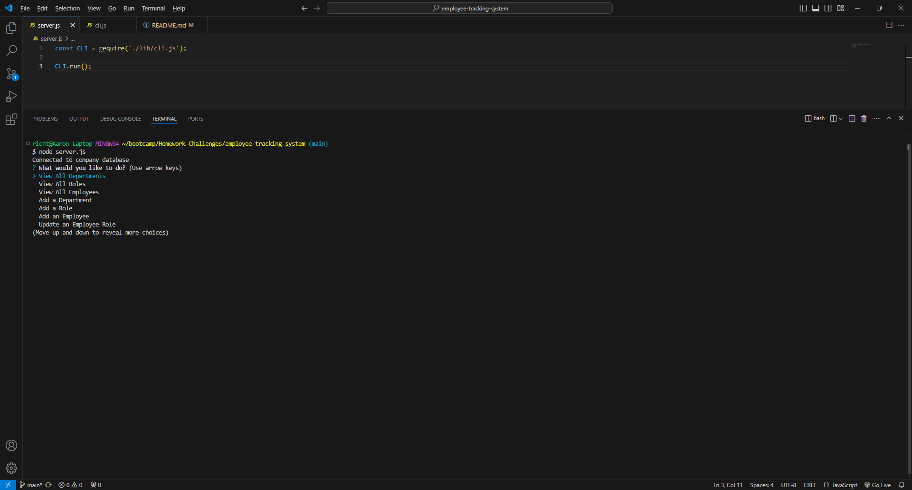
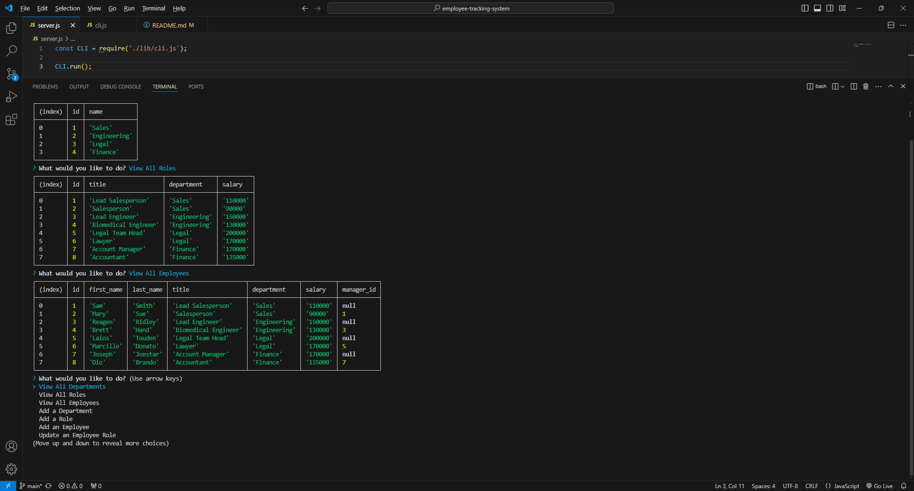

# employee-tracking-system

## Description

The goal of this project was to create a Node.js command-line application that would function as a content management system for a company. The application would allow the company to manage and display data relating to their employees.

## Installation

You will need to open the terminal and run npm install to load in all necessary dependencies. Next you will need to find and open the .env.EXAMPLE file and add in your postgres username and password. Then rename the .env.EXAMPLE file to be just .env. Next you will want to open the terminal and open postgres with the command psql -U postgres. Then run the schema.sql file in the db folder so the necessary database is possibly dropped and then created. Then run the seeds.sql file in the same folder. Once that is done the application should be ready to run.

## Usage

After installation is done you open the terminal and run the application with either node server.js or with npm start. You will then be given a prompt in the terminal that will ask you what you want to do.

Below are screenshots showing the application at start up and displaying some data tables.

Link to a walkthrough video showing the application in action:
[Walkthrough Video](https://drive.google.com/file/d/1tjINxDrr7AufFWJKmavSCUOOGZGhahwU/view?usp=sharing)

## Credits

N/A

## License

N/A

## Contribute

N/A